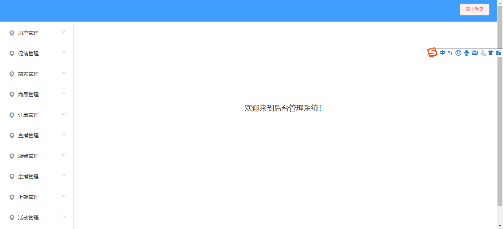

# shops-manager

## Project setup
```
yarn install
```

### Compiles and hot-reloads for development
```
yarn run serve
```

### Compiles and minifies for production
```
yarn run build
```

### Run your tests
```
yarn run test
```

### Lints and fixes files
```
yarn run lint
```

### Customize configuration


## 项目目录结构
```
 |-- manager-tab
    |-- README.md
    |-- babel.config.js
    |-- package-lock.json
    |-- package.json
    |-- postcss.config.js
    |-- tsconfig.json   
    |-- tslint.json    // 自定义tslint配置
    |-- vue.config.js   // webpack配置定制
    |-- public
    |   |-- favicon.ico
    |   |-- index.html
    |-- src
        |-- App.vue
        |-- main.ts
        |-- router.ts
        |-- shims-tsx.d.ts
        |-- shims-vue.d.ts
        |-- assets
        |-- common
        |   |-- common.ts   // 公共方法
        |   |-- constData.ts    // 业务静态数据
        |   |-- eleui_comp.ts    // 饿了么组件
        |   |-- helper.ts      // 时间金钱等公共方法 
        |   |-- utils.ts   // 环境等基础变量数据
        |   |-- validats.ts   // 表单校验
        |-- components      // 公共组件
        |   |-- Main.vue
        |   |-- interface.ts
        |   |-- creatEditor    
        |   |   |-- index.vue
        |   |-- croper    // 图片裁剪
        |   |   |-- index.vue
        |   |-- leftNav
        |   |   |-- leftNav.vue
        |   |-- pagination      // 分页组件
        |   |   |-- index.vue
        |   |-- search-input      // 查询条件组件
        |   |   |-- index.vue
        |   |-- topNav
        |   |   |-- topNav.vue
        |   |-- upLoad     // 文件上传
        |       |-- index.scss
        |       |-- index.vue
        |-- model    // 数据交互相关
        |   |-- api   // http请求接口
        |   |   |-- login.ts
        |   |   |-- request.ts
        |   |-- interface   // 数据模型
        |   |   |-- index.ts
        |   |-- vuex    // vuex数据存储
        |       |-- index.ts
        |       |-- modules
        |           |-- navigator.ts // tab切换
        |-- views
            |-- About.vue
            |-- Home.vue
            |-- userManager
            |   |-- userInfo.ts
            |   |-- userList.vue
            |-- css
            |-- login   // 登陆
            |   |-- index.scss   // 样式
            |   |-- index.vue   // 页面 + js
```
## 项目截图
